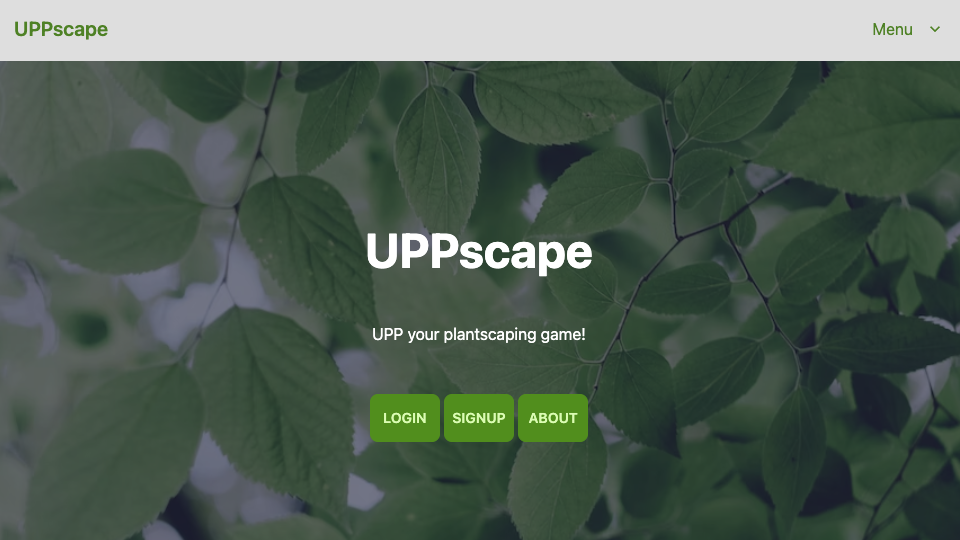

# "UPPscape - The Ultimate Plantscaping Planner"UPPscape provides all the tools a plantscaping company needs to track accounts, plant locations, and service of plants.
**Link to project:** https://uppscape.cyclic.app/

## How It's Made:
**Tech used:** JavaScript, Node, MongoDB, Tailwind, CSS
UPPscape provides all the tools a plantscaping company needs to track accounts, plant locations, and service of plants. User authentication with separate user types for managers and technicians ensures certain changes are only made by management. 
Each user can add notes to plant locations as well as the option to mark them as a "concern." When managers log in they immediately see a link to a list of these concerns, detailed summaries, and the option to resolve them.
Each plant location displays a time stamp of its most recent service as well as the name of the servicing technician to ensure clarity on task completions.

## Optimizations
UPPscape currently allows users to upload their own plant photos and data. In addition to this I would like to add a pull-down list of pre-existing plant images/data for at least a hundred common plants for users to choose from. No public houseplant API currently exists as far as I can tell (please message me if you know of one!) so I am in the process of creating one that will be open source and publicly available.
Other planned optimizations include: - Ability to assign accounts to certain technicians- Ability to limit technicians to only view accounts they are assigned to - Setting geolocation data for each account and causing its page to appear when user approaches- Option to display all recent note changes to management-level users- Page showing current warehouse inventory- Page showing purchased inventory en route to warehouse

